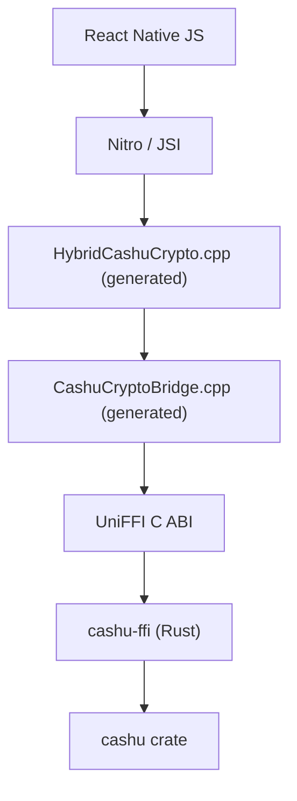

# @cashu/cashu-native

Native cashu crypto for React Native. The Rust
[`cashu`](../../crates/cashu) crate reaches JavaScript through
[UniFFI](https://mozilla.github.io/uniffi-rs/) and
[Nitro Modules](https://nitro.margelo.com), and every layer between the two is
generated.

It exists so [cashu-ts](https://github.com/cashubtc/cashu-ts) can hand its
slowest work to Rust without changing its public API: `NativeOutputDataCreator`
implements cashu-ts's `OutputDataCreator` interface, and a wallet opts in by
passing it in.

## Using it

```ts
import { Wallet } from '@cashu/cashu-ts';
import { isNativeAvailable } from '@cashu/cashu-native';
import { NativeOutputDataCreator } from '@cashu/cashu-native/creator';

const wallet = new Wallet(mint, {
  outputDataCreator: isNativeAvailable() ? new NativeOutputDataCreator() : undefined,
});
```

The low-level module is available too, and the root entrypoint does not import
cashu-ts, so this path works without it installed:

```ts
import { getCashuCrypto } from '@cashu/cashu-native';

const outputs = getCashuCrypto().createDeterministicOutputs(
  [16n, 8n, 4n],
  seed,
  counter,
  keysetId,
);
```

cashu-ts is an optional peer dependency. Install it alongside this package only
if you import `@cashu/cashu-native/creator`.

Only output construction moves native. `toProof` stays on cashu-ts's own
`OutputData`, so the amount binding, DLEQ and BLS checks that protect a wallet
against a malicious mint are the reviewed ones.

## Architecture



Nothing routes through Node or another JavaScript runtime; the Node harness
under `test/` is for testing and benchmarking only.

## Layout

| Path | Generated? | What it is |
|---|---|---|
| `src/generated/*.nitro.ts` | yes | Nitro spec, from the UniFFI metadata |
| `src/generated/*Errors.ts` | yes | Typed error classes and the payload parser |
| `src/index.ts` | no | Module accessor and re-exports |
| `src/NativeOutputDataCreator.ts` | no | The cashu-ts integration, the `/creator` subpath |
| `nitrogen/generated/**` | yes | Nitrogen's specs and autolinking |
| `cpp/generated/*Ffi.hpp` | yes | `extern "C"` view of the UniFFI ABI |
| `cpp/generated/*Bridge.{hpp,cpp}` | yes | Plain C++ over that ABI |
| `cpp/generated/Hybrid*.{hpp,cpp}` | yes | Nitro HybridObject implementations |
| `cpp/test/bridge_tests.cpp` | no | C++ harness over the bridge |
| `test/generated/*.koffi.mjs` | yes | Node harness, for tests and the benchmark |
| `test/*.mjs` | no | Node tests, parity checks and the benchmark |
| `nitro.json`, `package.json`, `CashuNative.podspec`, `android/**` | no | Packaging |

Nothing marked generated is in git. `just nitro-bindings` writes all of it from
the UniFFI metadata, so a fresh clone has only the hand-written files above
until that runs. The npm tarball does carry it, put there by
`just nitro-package`.

## Commands

All of them run from the repository root.

```sh
just nitro-bindings    # regenerate everything from the Rust exports
just nitro-check       # type-check the adapters against Nitro and JSI
just test-nitro        # C++ harness over the generated bridge
just test-nitro-node   # Node harness plus cashu-ts parity
just bench-nitro       # cashu-ts versus Rust
just nitro-ios         # Rust for iOS, assembled into an XCFramework
just nitro-android     # Rust for every Android ABI, into jniLibs
just nitro-package     # everything the tarball needs, then npm pack
```

The dev dependencies install themselves on first use: any recipe that needs
nitrogen runs `npm ci` when `node_modules` is missing, so the lockfile decides
which nitrogen version generates the output.

Adding a native operation is one Rust function and one command:

```rust
#[uniffi::export]
pub fn another_expensive_operation(input: Vec<u8>) -> Vec<u8> {
    // ...
}
```

```sh
just nitro-bindings
```

The TypeScript spec, the nitrogen spec, the C++ bridge, the Nitro adapter and
the Node harness all pick it up.

## Requirements

- Node 22 or newer for nitrogen. `just nitro-bindings` finds an nvm install if
  the default `node` is older. Under `nix develop .#bindings` it comes from the
  shell.
- `cargo install cargo-ndk` and `ANDROID_NDK_HOME` for the Android build.
- Xcode for the iOS build.

## Publishing

`just nitro-package` runs the whole pipeline, builds the TypeScript and packs
the tarball, which is the only way the package gets the generated sources and
the native libraries git does not carry. A `prepack` guard refuses to build a
tarball that is missing any of them, so `npm publish` from a clean tree fails
rather than shipping an empty package. It needs macOS, Xcode, `cargo-ndk` and
`ANDROID_NDK_HOME`.

## Performance

`just bench-nitro` measures cashu-ts against the same operations in Rust,
in one Node process, on a release build. On an M-series laptop:

| workload | outputs | cashu-ts | Rust | speedup |
|---|---|---|---|---|
| deterministic outputs, 1 sat | 1 | 1.08 ms | 0.14 ms | 7.6x |
| deterministic outputs, 1023 sats | 10 | 6.67 ms | 1.34 ms | 5.0x |
| NUT-09 restore, 500 counters | 500 | 561 ms | 67 ms | 8.4x |
| random outputs, 1023 sats | 10 | 2.57 ms | 0.31 ms | 8.3x |

The win comes from BIP32 hardened derivation and secp256k1 point arithmetic.
It disappears when the crossing costs more than the work:

| workload | cashu-ts | Rust | speedup |
|---|---|---|---|
| sha256 of 32 bytes | 0.6 us | 5.5 us | 0.1x |
| sha256 of 1 MiB | 3.47 ms | 2.70 ms | 1.3x |

A 32 byte hash is slower natively than in JavaScript, and a 1 MiB hash is
dominated by copying the buffer in and out. Batch work behind one call, the way
the output builders do, rather than crossing per item.

The benchmark reaches Rust through koffi rather than JSI, so per-call overhead
is not identical to React Native's. Everything else, the UniFFI buffer encoding
included, is the same work the Nitro path does.

## Testing

`just test-nitro` runs the C++ harness: primitives, 64-bit amounts,
byte buffers up to 4 MiB, records, optionals, enums, structured errors, and an
object lifecycle check that creates and destroys twenty thousand handles.

`just test-nitro-node` adds the cashu-ts parity suite, which asserts that the
native path produces byte-identical blinded messages, secrets and blinding
factors for the same seed and counter. A wallet that swaps implementations must
be able to restore what the other one created.

On macOS the harness can be checked for leaks:

```sh
BRIDGE_TEST_CHURN=2000 leaks --atExit -- target/nitro-cpp-tests/bridge_tests
```
