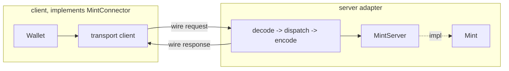

# Server-side MintServer trait as a transport-agnostic RPC seam

* Status: proposed
* Authors: Cesar Rodas
* Date: 2026-08-05
* Targeted modules: cdk (mint::server), cdk-axum, cdk-integration-tests
* Associated tickets/PRs: branch `mint-server-trait`

## Context and Problem Statement

The wallet reaches a mint through `MintConnector`
(`crates/cdk/src/wallet/mint_connector/mod.rs`), a client-side trait whose
methods are the mint's RPCs (`post_swap`, `post_mint_quote`, `post_mint`,
`post_melt`, `get_mint_info`, and so on). `HttpClient` implements it over HTTP.

There was no matching seam on the server. The mint's business logic lives on
`Mint`, but the code that turns a wire request into a `Mint` call, and a `Mint`
result back into a wire response, existed in two hand-written copies: the
`DirectMintConnection` test helper and the `cdk-axum` HTTP handlers. Both do the
same `String` <-> `QuoteId` conversions and the same payment-method enum
dispatch. HTTP was also the only way to reach a mint out of process; the
translation from transport bytes to `Mint` calls was hard-wired into the axum
handlers.

Two questions follow. What is the server-side counterpart of `MintConnector`,
and how can a mint be reached over transports other than HTTP (for example
in-process, gRPC, or a peer-to-peer transport such as Iroh) without duplicating
the conversions or touching mint business logic?

## Decision Drivers

* One home for the wire conversions (`String` <-> `QuoteId`, per-method enum
  matching), instead of one copy per transport.
* Symmetry: the client has a `MintConnector` trait; the server should have a
  matching trait so both sides speak the same request/response types.
* Transport independence: adding a transport should not touch `Mint` or the
  conversions, only add a client implementation and a server adapter.
* Keep HTTP-specific behavior (auth verification, NUT-19 caching, async melt,
  NUT-17 subscriptions, the keys envelope shape) out of the shared seam so it
  does not leak into every transport.

## Considered Options

#### Keep the conversions in each connector and handler (prior state)

Each transport re-implements request/response translation against `Mint`'s
inherent methods.

**Pros:**

* Good, because there is no new abstraction to learn.

**Cons:**

* Bad, because the `String` <-> `QuoteId` conversion and enum dispatch are copied
  per transport and drift independently.
* Bad, because there is no named server contract; "what a server must answer" is
  implicit and scattered.

#### Make cdk-axum generic over a trait, conversions still ad hoc

Introduce a trait only for the HTTP layer's benefit, leaving the conversions
where they are.

**Pros:**

* Good, because the HTTP layer gains a seam.

**Cons:**

* Bad, because it solves only HTTP and still duplicates the conversions for the
  in-process and any future transport.

#### Introduce a MintServer trait implemented once for Mint (chosen)

A server-side RPC trait mirroring `MintConnector`, speaking the same wire types,
implemented a single time for `Mint`. Every transport becomes a thin adapter
over it.

**Pros:**

* Good, because the conversions live once, in `impl MintServer for Mint`.
* Good, because it names the server contract and makes it transport-agnostic.

**Cons:**

* Bad, because it is one more trait, and it deliberately excludes HTTP-specific
  concerns, so those must be handled per transport.

## Decision Outcome

Chosen option: "introduce a `MintServer` trait implemented once for `Mint`".

`MintServer` (`crates/cdk/src/mint/server.rs`) is the mirror image of
`MintConnector`: one method per mint RPC, all speaking the wire types (the NUT
request/response structs, `String` quote IDs), all returning `cdk::Error`.
`impl MintServer for Mint` is the single place that converts wire requests into
`QuoteId`-typed calls on `Mint` and converts the results back. The `cdk-axum`
core handlers now dispatch through it (`state.mint.post_swap(payload)` instead of
`state.mint.process_swap_request(payload)`), and the in-process
`DirectMintConnection` (a test helper) forwards to it.

The seam is intentionally the request/response RPC surface only. It does not
include auth verification, response caching, the async-melt branch, or the HTTP
keys envelope; those stay in the transport that needs them (see Negative
Consequences). Streaming is a seam of its own: both traits vend a raw stream
channel via `open_stream`, and a protocol (NUT-17) is layered above it (see
"Streams: `open_stream` on both traits").

### How a transport is built on this seam

`MintConnector` and `MintServer` are two ends of the same wire vocabulary. A
transport is therefore two small pieces plus a codec, and nothing else:

1. A **client**: a type that implements `MintConnector`, turning each method call
   into a transport message and decoding the reply.
2. A **server adapter**: code that accepts a transport message, decodes it into
   the NUT wire request type, calls the matching `MintServer` method on the
   `Mint`, and encodes the response back.
3. A **codec / framing** and an **addressing scheme** for that transport.

Nothing in these three touches mint business logic or the `String` <-> `QuoteId`
conversions; those are behind `MintServer`. Because the wallet already holds its
connector as `Arc<dyn MintConnector + Send + Sync>`, pointing a wallet at a
different transport is a matter of constructing a different connector.



What every transport reuses, unchanged: `MintServer` (all mint logic and the
conversions), the NUT request/response types (already `serde`-serializable), and
the `MintConnector` contract (so the wallet code does not change).

Worked examples:

* **In-process** (implemented, `DirectMintConnection`): no codec and no framing.
  The client calls the `MintServer` methods on the wrapped `Mint` directly. This
  is the degenerate case that shows the seam with the transport removed.
* **HTTP** (implemented, `HttpClient` + `cdk-axum`): the codec is JSON, framing is
  HTTP requests, addressing is a URL. The axum router is the server adapter, each
  route decodes a body and calls one `MintServer` method.
* **gRPC** (illustrative): the client is a `tonic` client implementing
  `MintConnector`; the server adapter is a `tonic` service whose handlers map one
  RPC each to a `MintServer` method. The codec is protobuf (or the NUT JSON
  carried as bytes); addressing is `host:port`. The request/response set is
  already fixed by `MintServer`, so the `.proto` is a direct transcription of its
  methods.
* **Iroh** (illustrative, QUIC peer-to-peer): the client is an Iroh endpoint that
  opens a bidirectional stream per request and implements `MintConnector`; the
  server adapter accepts streams, reads a framed request, dispatches to
  `MintServer`, and writes the framed response. The codec is a length-delimited
  frame of the NUT JSON; addressing is an Iroh `NodeId` rather than a URL, which
  brings authenticated node identities and NAT traversal without a public
  hostname. The mint becomes reachable by node id.

### Streams: `open_stream` on both traits

Unary request/response is one seam; a subscription (NUT-17) is the other. A
subscription is not a single call and reply, it is a long-lived, two-way exchange,
so it needs a **stream channel**. Every transport provides that channel in its own
form: a WebSocket for HTTP/S, a bidirectional QUIC stream for Iroh, a streaming
RPC for gRPC. WebSocket is HTTP's realization of the stream channel, not the
abstraction; the abstraction is the stream.

The trait seam for this is deliberately minimal and content-agnostic: both traits
vend a raw duplex of opaque `String` messages, and **the trait never inspects what
flows over it**. A protocol (NUT-17, or anything future) is layered above, by a
runner that operates on the raw halves.

```rust
// cdk_common::stream_channel: StreamTx::send(String), StreamRx::recv() -> Option<Result<String>>
MintConnector::open_stream(&self) -> Result<(StreamTx, StreamRx), Error>  // client
MintServer::open_stream(&self)    -> Result<(StreamTx, StreamRx), Error>  // server
```

Both default to unsupported; a stream-capable end overrides. Implemented today:
`HttpClient::open_stream` dials the mint's `/v1/ws` and wraps the WebSocket halves
(`cdk_common::stream_channel::from_ws`); `Mint::open_stream` (via `MintServer`)
returns one end of an in-memory duplex and spawns the NUT-17 runner
(`crates/cdk/src/mint/stream.rs`) on the other. The in-process `DirectMintConnection`
forwards its `open_stream` to the mint's.

`open_stream` is symmetric in signature, but the halves are wired differently by
each side, which is inherent to dial-vs-accept:

|         | client (`MintConnector`)                        | server (`MintServer`)                                   |
|---------|-------------------------------------------------|---------------------------------------------------------|
| meaning | opens/dials the channel (WebSocket / QUIC / gRPC) | vends its end; the peer is serviced by the protocol runner |
| below   | transport-specific dial                         | transport-specific accept, in the adapter               |

A new transport gets streams by implementing `open_stream` on its connector
(dial + wrap into `StreamTx`/`StreamRx`) and, on the server side, having its
adapter bridge an accepted connection to a `Mint` and run the same NUT-17 runner.
The runner is transport-agnostic because it speaks only the `String` halves.

Notes:

* **The trait is content-agnostic.** NUT-17 framing (parse `WsRequest`, subscribe
  via `pubsub_manager`, serialize notifications) lives in the runner, not in
  `open_stream`. Swapping in a different stream protocol touches only the runner.
* **Multiplexing and poll fallback** stay above the primitive: the wallet's
  `SubscriptionManager` (multiplex many sub-ids over one channel, fall back to
  HTTP polling) is unchanged; it now dials through `open_stream`, which replaced
  the old ws-specific `connect_websocket`.
* **Send bounds**: `MintConnector` is `async_trait(?Send)` on wasm while
  `MintServer` is always `Send`, so `StreamTx`/`StreamRx` carry the same per-side
  `cfg_attr` treatment.

`cdk-axum` runs the shared runner too: its ws handler verifies auth, then bridges
the accepted WebSocket into `StreamTx`/`StreamRx` (the server-side mirror of
`from_ws`, translating frames and answering pings) and hands them to
`Mint::serve_stream`. The HTTP server and the in-process server share one NUT-17
implementation; the runner's `mint_connector_test!` suite now exercises it over
both.

### Positive Consequences

* The `String` <-> `QuoteId` conversion and payment-method dispatch live once, in
  `impl MintServer for Mint`.
* A new transport is roughly one `MintConnector` implementation plus one server
  adapter and a codec. It adds no mint logic and no conversion code.
* The wallet is already transport-agnostic (`Arc<dyn MintConnector>`), so it can
  talk to a mint over any transport by swapping the connector, with no wallet
  changes.
* The server contract is named and greppable: what a mint must answer is the
  `MintServer` method set.

### Negative Consequences

* `MintServer` is deliberately the plain request/response surface. Cross-cutting
  and HTTP-shaped concerns are excluded and must be provided per transport:
  * **Auth** (NUT-21 / NUT-22): `verify_auth` is not on `MintServer`. A transport
    that enforces auth gates the call itself before dispatching, as `cdk-axum`
    does today.
  * **Subscriptions** (NUT-17): not part of the unary seam; both traits vend a raw
    `open_stream` channel and the NUT-17 runner is layered above it (see "Streams:
    `open_stream` on both traits"). `cdk-axum` bridges its WebSocket onto that
    shared runner, so the loop is no longer duplicated.
  * **Async melt** (`Prefer: respond-async`): `MintServer::post_melt` settles
    synchronously. A transport that wants the async flow calls `Mint::melt`
    (which returns a `PendingMelt`) directly, as the axum melt handler does.
  * **Keys shape**: the HTTP `GET /v1/keys/{id}` returns a `KeysResponse`
    envelope, whereas `MintServer::get_mint_keyset` returns a single `KeySet`
    (the client-side convenience shape). A transport picks whichever it needs.
* `MintServer` is used by static dispatch on `Mint`; it is not currently used as
  `Arc<dyn MintServer>`. A generic server adapter over `S: MintServer` is
  possible, but making `cdk-axum` fully generic over the trait was left out of
  scope; its handlers still hold `Arc<Mint>` because auth, the stream-channel
  subscription bridge, and the keys endpoints call `Mint` methods that are not on
  the trait.

## Links

* Mirrors the client-side `MintConnector`
  (`crates/cdk/src/wallet/mint_connector/mod.rs`).
* Validated by the `mint_connector_test!` suite
  (`crates/cdk-integration-tests/src/mint_connector_test/`), which runs the same
  bodies over the in-process connector and a live `cdk-axum` server, a sanity
  check that a transport and the mint agree on the wire.
