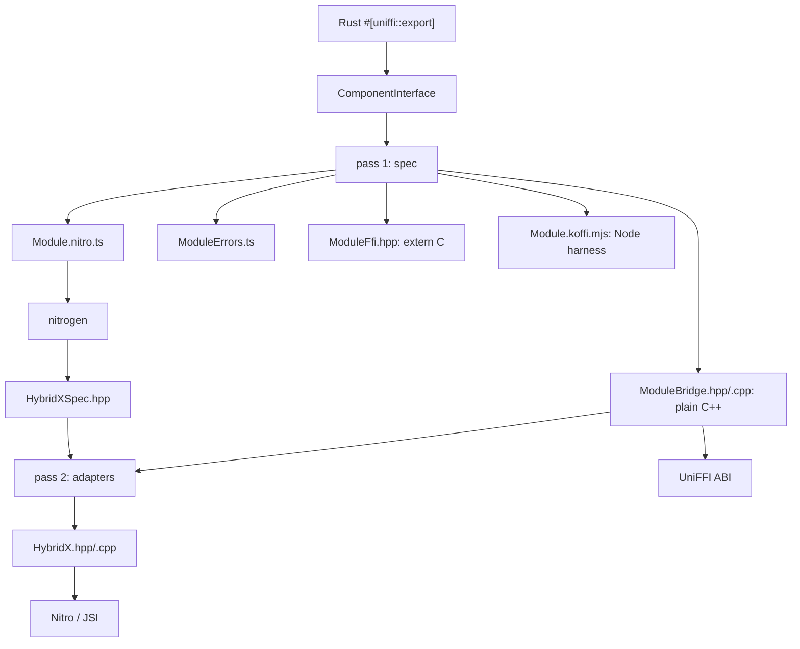

# uniffi-bindgen-nitro

Generates [Nitro Modules](https://nitro.margelo.com) React Native bindings from
UniFFI metadata, so the `#[uniffi::export]` surface is the only interface
definition anyone maintains by hand.

## What it reads

A built cdylib. `uniffi_bindgen::library_mode::find_components` extracts the
`ComponentInterface` that the proc macros embedded in the library, which is why
no Rust source is ever parsed and no symbol name is ever hardcoded: every
`uniffi_*` symbol the generated C++ calls comes from that metadata, as do the
ABI contract version and the per-function checksums used as a staleness guard.

## What it writes

Generation happens in two passes because nitrogen sits in the middle.



Pass two reads the spec headers nitrogen just produced and copies each
`virtual ... = 0;` signature verbatim, so the overrides cannot drift from
whatever rules nitrogen applies when turning TypeScript into C++.

The bridge layer is plain C++ with no React Native dependency. That is what
makes everything crossing the UniFFI ABI testable with a bare toolchain, and it
keeps the Nitro layer down to type conversion.

## Type mapping

| UniFFI | TypeScript | Nitro C++ | Bridge C++ |
|---|---|---|---|
| `bool` | `boolean` | `bool` | `bool` |
| `i8`–`i32`, `u8`–`u32`, `f32`, `f64` | `number` | `double` | the exact width |
| `i64` / `u64` | `Int64` / `UInt64` (bigint) | `int64_t` / `uint64_t` | same |
| `String` | `string` | `std::string` | `std::string` |
| `Vec<u8>` | `ArrayBuffer` | `std::shared_ptr<ArrayBuffer>` | `std::vector<uint8_t>` |
| `Vec<T>` | `T[]` | `std::vector<T>` | `std::vector<T>` |
| `Option<T>` | `T \| undefined` | `std::optional<T>` | `std::optional<T>` |
| `HashMap<String, V>` | `Record<string, V>` | `std::unordered_map` | `std::unordered_map` |
| `#[derive(uniffi::Record)]` | `interface` | struct | struct |
| field-less `#[derive(uniffi::Enum)]` | string union | `enum class` | `enum class` |
| `#[derive(uniffi::Object)]` | `HybridObject` | `std::shared_ptr<HybridXSpec>` | handle-owning class |
| `#[derive(uniffi::Error)]` | typed `Error` subclass | thrown | thrown |

64-bit integers are never mapped to `number`. Everything else that would lose
range or precision is rejected rather than narrowed.

## Copies

Two are unavoidable and both are documented in the generated code. A
`RustBuffer` belongs to Rust's allocator, so its bytes are copied out before
the buffer is freed. An `ArrayBuffer` arriving from JavaScript may be collected
at any time, so its bytes are copied in. Returned byte buffers are moved into
the `ArrayBuffer` rather than copied again.

## Errors

A `#[derive(uniffi::Error)]` enum becomes a C++ exception class plus a
TypeScript class per error type. Nitro surfaces only an exception's message to
JavaScript, so the adapter encodes the variant and its fields as JSON behind a
marker prefix and the generated TypeScript rebuilds a typed error with
per-variant narrowing helpers. 64-bit and byte fields arrive as strings, which
is the one place JSON forces a change of shape.

## Usage

```sh
uniffi-bindgen-nitro spec \
  --library target/debug/libcashu_ffi.dylib \
  --crate cashu_ffi \
  --config crates/cashu-ffi/uniffi.toml \
  --ts-out bindings/react-native/src/generated \
  --cpp-out bindings/react-native/cpp/generated \
  --node-out bindings/react-native/test/generated

# ... run nitrogen ...

uniffi-bindgen-nitro hybrids \
  --library target/debug/libcashu_ffi.dylib \
  --crate cashu_ffi \
  --config crates/cashu-ffi/uniffi.toml \
  --nitrogen bindings/react-native/nitrogen \
  --cpp-out bindings/react-native/cpp/generated
```

`just nitro-bindings` runs all three steps.

## Configuration

The crate's `uniffi.toml` may carry a `[bindings.nitro]` section:

```toml
[bindings.nitro]
module_name = "CashuCrypto"      # root hybrid object and file prefix
cxx_namespace = "cashucrypto"    # nested under margelo::nitro
cdylib_name = "cashu_ffi"
async_methods = ["expensive_operation"]
```

`async_methods` names exported functions whose Rust signature stays
synchronous but whose generated Nitro method returns a `Promise`, resolved from
a background thread. It is a list of names rather than a second API definition,
so the Rust signature remains the only description of the call.

## Not supported

The generator refuses these rather than emitting code that would not compile or
would silently misbehave:

- Rust `async fn`. UniFFI futures need the poll/complete/free protocol, which
  is not implemented; use `async_methods` for CPU-bound work instead.
- Callback interfaces and foreign-implemented trait interfaces.
- Enum variants carrying fields, outside error enums. A tagged union has no
  Nitro equivalent.
- Tuple variants. Name the fields so JavaScript can read them.
- Maps with non-string keys.
- `Option<Option<T>>`.
- Objects as arguments. They can be returned, and methods can be called on
  them, but UniFFI's borrow semantics for object arguments are not modelled.
- `Timestamp` and `Duration`.
